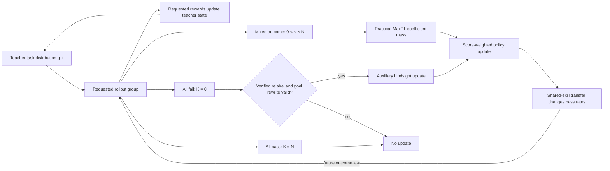

# Curriculum-MaxRL: framework and research contract

This document is the implementation specification and scientific claim boundary
for Curriculum-MaxRL. It connects the exact estimator results in
[PROOFS.md](curriculum_maxrl/PROOFS.md), the retained evidence and limitations in
[VALIDATION.md](curriculum_maxrl/VALIDATION.md), the reusable CPU/Gymnasium
implementation in [`frontier_rl`](frontier_rl/README.md), and the proposed
[verl/MaxRL integration](verl_integration/README.md).

The central proposal is narrow:

> When practical MaxRL is the learner, allocate rollout groups toward tasks
> whose estimated pass rates imply high expected MaxRL coefficient mass, retain
> explicit exploration, and optionally recover semantically valid auxiliary
> goals from all-fail groups.

**Curriculum-MaxRL is the method name.** The coefficient-mass frontier teacher
and verified hindsight recycling are separable components of that method, not
competing methods. A valid base system may run the teacher with hindsight off;
hindsight may be enabled only where the environment satisfies its contract.

The coefficient-mass rule is exact for its stated statistic. It is not a theorem
that the adaptive teacher is globally optimal, maximizes gradient norm, or
improves every environment. The strongest retained evidence is currently
algebraic, synthetic, and local CPU/Gymnasium validation, plus one narrow
independently verified neural result. Acrobot V1 failed its headroom gate, and
V2 passed five of six gates but stopped because most disjoint controls did not
learn. The source-locked V3 shared-H64 confirmation then found a
teacher-minus-uniform transition-AUC difference of `+0.0363524` across 20
paired seeds (95% paired bootstrap CI `[0.0164536,0.0553949]`; exact two-sided
sign-flip `p=0.00263977`) and supported its preregistered efficacy decision.
This supports positive shared-policy efficacy only on the fixed eight-threshold
family; it does not establish transfer, capacity effects, hindsight, or general
Acrobot performance. V5A subsequently passed all seven outcome-field-blind
feasibility gates on a fresh 27-run 3×3 grid, selected `U*=250`, and authorized
the fresh V5B factorial. V5B completed all 180 runs with zero run failures and
intact raw records, but its frozen analyzer failed exact diagnostic
reconstruction because NumPy and Python scalar norm reductions differed at
floating-point roundoff scale. The exact-equality rule makes the primary
family a procedural NO-GO, so V5B adds no performance result. A separate
capacity-matched neural MountainCar
V1R2 development matrix completed all reconstruction checks but stopped at
NO-GO because all 15 hardest-goal AUCs and the pooled all-pass count were zero;
its confirmatory seeds remain untouched. Corrected GPU, behaviorally adequate
broader neural, and language-model validation remain required before making
scale or generality claims.

“Registered,” “sealed,” and “predeclared” below mean locally source-locked
before the corresponding seed block, not externally timestamped
preregistration. Current bytes match the V3 and later manifests. The historical
V2 lock records an older runner hash that does not match the V3-era runner at
HEAD; reviewers must treat that missing byte-for-byte historical runner as a
V2 provenance limitation.

## 1. Problem definition

Let the training pool contain `m` discrete tasks, goals, levels, or prompts
`x in X = {1, ..., m}`. Let:

- `rho_i` be the desired target/evaluation mixture over tasks;
- `m_theta(z | x)` be the current policy's trajectory distribution;
- `r_x(z) in {0,1}` be a theta-independent verifier;
- `p_theta(x) = P(r_x(z)=1 | x)` be the current pass probability;
- `S_theta(z,x) = grad_theta log m_theta(z | x)` be the trajectory score; and
- `N >= 2` be the number of conditionally independent, on-policy rollouts in a
  group.

For a group on task `x`, write `r_i` for its rewards and
`K = sum_i r_i`. Practical MaxRL uses a centered group update only when the
group contains both successes and failures. It therefore receives no update
from an all-fail group and a zero update from an all-pass group.

Curriculum-MaxRL adds two scheduling decisions around that learner:

1. **Which task receives the next rollout group?** Estimate each task's current
   pass rate and prioritize the region with high expected practical-MaxRL
   coefficient mass.
2. **What should happen to an all-fail group?** If the environment can identify
   a different goal actually achieved by the trajectories, construct an
   auxiliary update under an explicit hindsight-validity contract. Otherwise,
   skip the group.

The intended output is a training system, not a new environment objective. The
system must say whether it is optimizing an adaptive curriculum mixture or
preserving a fixed target mixture with importance weighting.

## 2. Assumptions and scope

The exact results in this repository require the following assumptions:

1. Rewards are binary, or continuous verifier outputs are explicitly
   thresholded and the result is described as a binary proxy.
2. The `N` rollouts in one estimator group are sampled from one frozen policy
   and one requested task, conditionally independently given that policy and
   task.
3. The verifier does not depend on `theta`, the score identity is valid, and
   differentiation can pass through the rollout expectation.
4. Task identifiers are stable and contiguous within a run. Dataset source
   indices are not assumed to satisfy this condition.
5. The discounted Beta state used by the teacher is a tracking heuristic. Its
   values are pseudo-counts, not a calibrated Bayesian posterior for a drifting
   policy.
6. Shared-parameter transfer is an empirical mechanism, not a theorem. A task
   can be informative according to the scalar utility and still fail to help
   other tasks if gradients do not transfer.
7. Hindsight data are auxiliary, selected data. Correct rewards alone do not
   make their gradient distribution equal to fresh on-task data.
8. Compute comparisons report both requested rollout count and actual
   environment transitions or generated tokens. Wall-clock time includes any
   evaluation performed inside the timed region unless stated otherwise.

Continuous or generated task spaces need an additional task model: a finite
binning, a changing candidate set with stable keys, or a parametric density
teacher. The current array-indexed teacher does not solve that problem.

## 3. Causal story and falsifiable mechanism

The proposed mechanism is:



This chain separates facts that are sometimes conflated:

- Selecting a task with `p > 0` can increase the probability of obtaining a
  mixed group on a *future* draw. It cannot retroactively rescue the all-fail
  group already sampled.
- Expected scalar coefficient mass is calculable from `p`. The realized
  gradient also depends on score norms, directions, cancellations, the
  optimizer, and parameter sharing.
- Shared transfer is the proposed bridge from local task selection to broader
  curriculum progress. The retained shared/per-task comparison is a confounded
  diagnostic because it also changes capacity and data flow. The V2 Acrobot
  factorial matched total and active capacity in separate controls, but most
  controls failed its behavioral-learning gate. A capacity-matched *and
  behaviorally adequate* teacher-by-sharing factorial is required for a causal
  transfer claim.
- Hindsight creates an auxiliary training target; it is not evidence that the
  original requested task succeeded.

The causal claim should be rejected or narrowed if adaptive sampling raises
coefficient mass but does not improve transition-matched learning, if the
effect disappears under corrected random-number control, or if it only occurs
under invalid goal relabeling.

## 4. Mathematical core

### 4.1 MaxRL objective and estimator conventions

For pass probability `p`, the order-`T` MaxRL objective is

```text
J_T(p) = -sum_{k=1}^T (1-p)^k / k,
grad J_T = w_T(p) grad p,
w_T(p) = [1-(1-p)^T] / p.
```

For `N` binary rollouts, define

```text
H_N = 1{K>0} (1/K) sum_i r_i S_i
C_N = H_N - (1/N) sum_i S_i
D_N = 1{K>0} [(1/K) sum_i r_i S_i - (1/N) sum_i S_i].
```

Then

```text
E[H_N] = E[C_N] = grad J_N,
E[D_N] = grad J_{N-1}  for N >= 2.
```

The reusable implementation uses `D_N`. Calling that implementation an
unbiased order-`N` estimator is an off-by-one error; it is an unbiased
order-`N-1` estimator under the assumptions above. See
[Proposition 1](curriculum_maxrl/PROOFS.md#proposition-1-estimator-conventions-and-the-practical-off-by-one).

### 4.2 Exact coefficient-mass score

Let `a_i` be the scalar coefficient multiplying `S_i` in `D_N`, and define
the realized coefficient mass `A_N = sum_i |a_i|`. Then

```text
E[A_N] = 2 u_N(p),
u_N(p) = 1 - (1-p)^N - p.
```

For `N >= 2`, `u_N` is strictly concave and is maximized at

```text
p*_N = 1 - N^(-1/(N-1))
     = ln(N)/N + O((ln N)^2/N^2).
```

This is the mathematical reason to prioritize tasks near a low but nonzero
pass rate under practical MaxRL. It is not merely the generic Bernoulli
learnability score `p(1-p)`: that score equals the expected coefficient mass
of the repository's RLOO normalization up to a constant. The two criteria
coincide only for `N=2` and increasingly disagree near low `p` as `N` grows.

The scope of this result is important. `u_N(p)` is half the expected `L1` mass
of scalar coefficients. If every score has norm at most `G`, it gives the upper
bound

```text
E ||sum_i a_i S_i|| <= 2 G u_N(p),
```

not an equality for gradient norm and not a guaranteed decrease in loss.

### 4.3 Teacher distribution

For each task `i`, retain discounted pseudo-counts `(alpha_i, beta_i)`. After
observing `k` requested-task successes among `n` rollouts, update

```text
alpha_i <- 1 + decay (alpha_i - 1) + k
beta_i  <- 1 + decay (beta_i  - 1) + (n-k).
```

For one teacher decision, draw

```text
p_tilde_i ~ Beta(alpha_i, beta_i),
s_i = u_N(p_tilde_i)^gamma,
q_i = (1-floor) s_i / sum_j s_j + floor/m.
```

If all `s_i` vanish numerically, use the uniform distribution. The exponent
`gamma` controls concentration; it is not part of the coefficient-mass proof.
Use `gamma=1` as the conservative default. Values such as `gamma=4` are an
empirical hypothesis for strongly shared or chained task pools and must be
reported as a separate treatment, not silently folded into the exact
coefficient-mass score.

The floor yields, for any task and any history,

```text
P(no visit in next H group draws | history)
    <= (1-floor/m)^H
    <= exp(-floor H/m),
E[draws until revisit] <= m/floor.
```

This proves visitation only. It does not prove prompt-level estimation
accuracy, fast change detection, or low regret.

### 4.4 Optional rollout-count allocation

If pass rates are treated as known, each task has integer bounds
`1 <= L_i <= N_i <= U_i`, and the next total rollout budget is `B` with
`sum_i L_i <= B <= sum_i U_i`, then maximizing
the one-step total coefficient-mass utility

```text
sum_i u_{N_i}(p_i),  subject to sum_i N_i = B
```

is solved by starting from all `L_i` and repeatedly assigning a rollout to the
largest feasible marginal

```text
Delta_i(N_i) = p_i (1-p_i)^N_i.
```

This is an exact myopic allocation result, not a long-horizon curriculum
theorem. The current trainer uses a fixed `N`; variable allocation is a
separate, pending experiment.

### 4.5 Proof and claim ledger

The framework treats the following boundaries as part of the algorithm, not as
optional wording:

| result | what is established | what remains empirical |
|---|---|---|
| practical estimator | `D_N` targets `J_{N-1}` under the score assumptions | whether its optimizer implementation learns efficiently |
| frontier utility | `2u_N(p)` is exact expected scalar `L1` coefficient mass and has the stated unique peak | gradient norm, variance, loss decrease, transfer, and long-horizon return |
| uniform floor | the revisit probability and waiting-time bounds hold for every adaptive history | tracking calibration, recovery speed, and regret |
| rollout allocation | greedy allocation exactly optimizes the fixed-pass-rate one-step separable proxy | nonstationary and long-horizon optimality |
| centered hindsight | per accepted goal, update-moment equality is necessary and sufficient; joint-law equality is sufficient; bounded scores give the unscaled TV bound | selection frequency, global mixture, scale, and whether a concrete relabeler has small TV or equal moments |
| success-only hindsight | the ML direction is recovered under the stated selected-success marginal-law condition | whether data-dependent goal selection satisfies that condition |
| conditional progress | an `L`-smooth target objective obeys the alignment-minus-second-moment lower bound in Proposition 8 | whether `u_N` sampling improves alignment enough to pay its second-moment cost |
| shared-policy curriculum | no theorem | efficacy and transfer are distinct experimental claims |

No learning-curve result may be cited as proof of a proved row, and no proved
row may be cited as an unconditional guarantee of a positive learning-curve
effect. Hyperparameters `gamma`, decay, floor, and hindsight scale remain
empirical even when the base score is exact.

## 5. Target-distribution contract

Adaptive task sampling changes the optimized mixture. Let `F_t` include the
current Thompson pseudo-draw and realized distribution `q_t`, but precede the
task draw. Conditional on `F_t`,

```text
E[D_{N,I_t} | F_t] = sum_i q_{t,i} grad J_{N-1,i}.
```

This is the gradient of the current mixture only with `q_t` treated as a
stop-gradient. Because `q_t` changes with policy-dependent history, the full
adaptive process generally does not follow one static objective.

Therefore every run must declare one of two modes:

### Adaptive-objective mode

Use the update as sampled. The learner follows a time-varying teacher-weighted
semi-objective. This is the mode implemented by the current reusable trainer
and proposed verl patch. Results must not be described as an unbiased gradient
of the uniform task objective unless `q_t` is uniform.

### Target-preserving mode

Choose a fixed target mixture `rho` and multiply each sampled task update by
`rho_i/q_{t,i}`. This recovers the target-mixture gradient when `q_{t,i}>0` on
the support of `rho`, at the cost of potentially higher variance. For uniform
`rho` and a uniform floor `f`, the importance weights are bounded by `1/f`.
This recovery is per requested group; when tasks have unequal transition or
token cost it is not automatically target-preserving per unit of compute.

Both modes are scientifically legitimate, but they answer different questions.
Evaluation is always reported under the declared target distribution, even
when training uses an adaptive objective.

This correction applies to the originally requested-task update. A relabeled
goal `g` is selected through a different, data-dependent mechanism; multiplying
that auxiliary update by `rho_g/q_{t,g}` does not in general make it an unbiased
target-mixture update. A run with hindsight should therefore describe the
hindsight term as auxiliary unless its relabel-selection law and update moments
have been separately characterized.

## 6. System components

An implementation has seven separable components:

| Component | Responsibility | State that must be explicit |
|---|---|---|
| Task index | Map environment goals/prompts to stable dense IDs | versioned ID-to-task mapping |
| Binary outcome adapter | Produce requested-task rewards and transition/token counts | verifier version and threshold |
| Teacher state | Track requested-task evidence | pseudo-counts, visits, decay, RNG state |
| Sampler | Produce `q_t` and task IDs | floor, `gamma`, sampler cursor/RNG |
| MaxRL estimator | Convert one fixed-policy group into scalar weights | estimator convention and group size |
| Relabeler | Build a valid auxiliary task, rewards, and rewritten trajectories | relabel rule and eligibility reason |
| Policy updater | Score trajectories under the credited task and apply weights | optimizer/model/checkpoint state |

Teacher evidence and learner evidence are deliberately separated. By default,
only rewards for the originally requested task update teacher pseudo-counts.
Relabeled rewards train the learner but do not claim success on, or update the
teacher state for, the requested task.

The current environment and learner protocols are in
[`frontier_rl/interfaces.py`](frontier_rl/interfaces.py); the scheduling logic
is in [`frontier_rl/trainer.py`](frontier_rl/trainer.py); and the teacher is in
[`frontier_rl/teacher.py`](frontier_rl/teacher.py).

## 7. Reference algorithm

The production algorithm should preserve the following order of operations:

```text
Inputs:
  task space X, policy theta, target mixture rho
  group size N >= 2, groups per step B
  decay 0 <= d <= 1, floor 0 < f <= 1, concentration gamma >= 0
  estimator = practical centered MaxRL
  hindsight mode in {off, centered, success_only}

Initialize alpha_i = beta_i = 1 and visits_i = 0 for every task i
Initialize independent, checkpointable RNG streams for training and evaluation

for training step t = 1, 2, ...:
    draw p_tilde_i ~ Beta(alpha_i, beta_i)
    compute q_t from u_N(p_tilde_i)^gamma and the uniform floor
    sample B requested task IDs from q_t

    for each requested group G on task x:
        generate its N rollouts without changing theta inside the group
        verify binary requested-task rewards r; K = sum(r)
        update alpha_x, beta_x, visits_x from r only
        record N, K, requested rollouts, transitions/tokens, and q_t[x]

        if 0 < K < N:
            w_i = r_i/K - 1/N
            if target-preserving mode:
                w_i <- w_i * rho_x/q_t[x]
            update policy using trajectories scored under x and weights w

        else if K == N:
            record all-pass group; do not relabel; apply no practical update

        else:  # K == 0
            record all-fail group
            if hindsight is off: continue

            ask environment to relabel G
            if no eligible relabel exists: continue
            receive credited task g, new binary rewards r', and rewritten data z'
            validate the hindsight contract before training

            if hindsight mode == centered:
                require 0 < K' < N; otherwise the centered update is zero
                w'_i = r'_i/K' - 1/N
            else if hindsight mode == success_only:
                require K' > 0
                w'_i = 1{r'_i=1}/K'

            multiply by declared hindsight scale
            update policy with every score evaluated under credited task g
            do not feed r' into requested-task teacher evidence

    evaluate with an RNG stream that cannot alter subsequent training samples
    checkpoint model, optimizer, task map, teacher, sampler, and every RNG state
```

Implementations may combine all group losses into one optimizer step. In that
case, log whether losses are summed or averaged over valid groups and keep the
choice fixed across arms. PPO epoch reuse does not change the definition of the
on-policy group that produced the estimator; any additional clipping and
importance-ratio approximation must be reported separately.

## 8. Environment integration contract

A new environment must implement the contracts in
[`frontier_rl/interfaces.py`](frontier_rl/interfaces.py):

```text
TaskSpace.n_tasks
TaskSpace.rollout_group(task_id, n_rollouts) -> GroupResult
TaskSpace.relabel(group) -> None or (new_task, new_rewards[, new_trajectories])
Policy.update(task_id, trajectories, weights)
```

Before an adapter is considered valid, verify all of the following:

1. `task_id` is a stable dense index in `[0, n_tasks)`, independent of dataset
   source indices or filtering order.
2. Every requested group contains exactly the configured `N` trajectories,
   unless variable-`N` support is explicitly enabled and the estimator and
   utility receive the realized `N`.
3. Requested-task rewards are binary and correspond to the same goal or prompt
   passed to the policy.
4. Trajectory scores used in one group correspond to the frozen policy that
   generated that group.
5. Actual environment transitions or generated tokens are retained in addition
   to episode/group counts. Structured trajectory records must not be counted
   by their dictionary-key length.
6. Evaluation resets, seeds, and random draws cannot change future training
   trajectories.
7. The relabeler returns `None` unless every semantic requirement below is
   satisfied.

For goal-conditioned Gymnasium environments, rewriting only the scalar reward
is insufficient when observations contain `desired_goal`, relative distance,
or another goal-dependent feature. Rebuild the goal-conditioned observation
for all positive- and negative-weight samples. If relabeling selects a state
first reached at time `tau`, truncate at that first hit or otherwise match the
fresh target's stopping rule; post-success transitions can change the update
law.

An environment acceptance test should include: one live group, one all-fail
group with a valid relabel, one all-fail group with no relabel, one all-pass
group, malformed rewards, invalid IDs, and save/resume equivalence.

## 9. Hindsight-validity contract

Hindsight is allowed only when semantic validity and statistical scope are
both documented.

### Semantic gates

1. **Exact verifier rewrite:** for every rewritten trajectory, recompute
   `r'_i=r_g(z'_i)` under the credited task's verifier. Both false positives
   and false negatives are invalid because they change `K'`, the centered
   negative weights, and the success-only denominator. “Closest state” is not
   enough.
2. **Conditioning rewrite:** prompts, observations, goal-relative features,
   masks, and scores are rebuilt for the credited task for *all* trajectories,
   including those receiving negative centered weights.
3. **Temporal alignment:** termination, truncation, reward timing, and any
   first-hit convention are compatible with a fresh rollout on the credited
   task.
4. **No teacher contamination:** relabeled outcomes do not update the
   originally requested task's pass-rate estimate. Any alternative feedback
   path is a separately named ablation.

### Statistical claim boundary

Fix the current policy and source mixture. Let `A_g` be the event that the
relabeler selects and accepts `g`, `P_{theta,g}` the joint law of a fresh
`N`-rollout group on `g`, `Q_{theta,g}=Law(rewritten group|A_g)`, and
`h_{theta,g}` the practical centered update scored under `g`. Per accepted
`g` update, hindsight is exact for fresh-task practical MaxRL if and only if

```text
E_Q[h_{theta,g}] = E_P[h_{theta,g}].
```

Equality of full laws `Q=P` is sufficient but not necessary. Verifier validity
does not imply either equality. Selection probability and auxiliary scale
still determine the global mixture and magnitude, so `Q=P` alone does not
recover a target-mixture gradient. Even conditioning fresh target groups on
`K>0`—or on the mixed event `0<K<N` used by Acrobot—generally changes the
centered estimator's scale.

For success-only hindsight, a narrower sufficient condition is available:
when a positive trajectory is selected from an accepted group with probability
`r'_i/K'`, that selected-positive marginal must equal
`m_theta(. | g, success)` after goal selection, and its score must be evaluated
under `g`. This identifies the per-accepted maximum-likelihood direction, not
`grad J_{N-1,g}` or a global target mixture. It is an assumption to test, not a
consequence of reward correctness.

Accordingly, use these descriptions:

- **Exact hindsight-MaxRL:** only after establishing the required update-moment
  equality or a sufficient distributional condition.
- **Proof-aligned success-only auxiliary update:** when using the conditional
  score identity but the selected-data law is not established.
- **Heuristic hindsight/self-imitation:** when semantic gates hold but neither
  statistical condition is established.

The current adapters should be described by the strongest label they actually
satisfy, never by the intended label.

## 10. Production loop and verl integration

The proposed verl integration is a stateful data-sampling change, so correctness
depends on more than inserting a new probability vector. The integration in
[`verl_integration`](verl_integration/README.md) should satisfy this checklist:

1. Wrap the final filtered/concatenated dataset and assign a new contiguous
   `curriculum_index`; never index teacher arrays by raw source metadata.
2. Keep the curriculum sampler stateful so dataloader iteration and teacher
   probabilities refer to the same task mapping.
3. Observe requested-task binary rewards only after reward computation and
   validate shape, task ID, group membership, and fixed group size.
4. Synchronize updated teacher/sampler state across workers before the next
   sampling decision. Define which process owns updates and how duplicates are
   prevented.
5. Persist task-map version, pseudo-counts, visit counts, sampler cursor, and
   teacher RNG state with every model checkpoint.
6. On resume, fail loudly if curriculum state is absent or incompatible. Do
   not combine a resumed sampler cursor with reset teacher counts.
7. Log the exact estimator convention, `N`, floor, `gamma`, decay, task
   probabilities, pseudo-count summaries, `K=0`, `0<K<N`, `K=N`, valid update
   groups, response tokens, and evaluation results.
8. Preserve independent model-sampling, teacher, shuffling, and evaluation RNG
   streams. Save and restore all of them.
9. Report whether curriculum weighting is target-preserving and, if so, log
   importance-weight distributions and clipping.
10. Test single-worker behavior, multi-worker synchronization, and resume
    equivalence before treating the patch as production-ready.

The checked-in patch is an integration proposal, not retained evidence of an
end-to-end multi-GPU run. Its current validation status is tracked in
[VALIDATION.md](curriculum_maxrl/VALIDATION.md).

## 11. Evaluation and ablation matrix

Every comparison should use paired seeds, identical initialization, identical
post-initialization RNG state, and the same update-counting convention. Report
means with seed-level uncertainty and paired differences. Use Holm correction
for a declared family of pairwise claims, and publish all members of that
family, including null results.

| Question | Required comparison | Primary measurement | Current status |
|---|---|---|---|
| Are estimator formulas implemented correctly? | raw `H_N`, full-CV `C_N`, practical `D_N` across small `N,p` | exact enumeration/Monte Carlo bias to `grad J_T` | proved and locally tested |
| Does the derived coefficient-mass score beat no curriculum? | uniform vs `u_N`, `gamma=1` | transition-matched target score and coefficient mass | positive synthetic evidence; tile-coded MountainCar `gamma=1` null; Acrobot V3 shared-H64 registered efficacy decision supported at `+0.0363524`, scoped to its fixed threshold family |
| Is MaxRL-specific utility necessary? | `u_N` vs legacy pass-probability and `p(1-p)`, same `gamma=1` | paired target-score difference | retained local evidence is mixed; no universal claim |
| Does concentration help chained pools? | `u_N^1` vs `u_N^4` with all else fixed | target score, coverage, entropy, collapse rate | retained local evidence; domain-specific hypothesis |
| Does hindsight add value? | off vs centered vs success-only | transition-matched target score, relabel validity rate | retained local evidence; distributional exactness unproved |
| Is centered hindsight better than success-only? | centered vs success-only | paired difference and calibration | tiny chain edge for centered; MountainCar tied; no stable cross-domain ranking |
| How sensitive is hindsight scale? | declared auxiliary-scale grid plus optimizer-matched control | target score per rollout and per optimizer FLOP | retained chain sweep is monotone through 8; V4A stopped; V5A passed and selected `U*=250`; completed V5B is a procedural NO-GO because its frozen exact-reconstruction rule failed, so fresh V5C is required |
| Is shared transfer causal? | capacity-matched, behaviorally adequate shared vs per-task parameters, crossed with curriculum vs uniform | curriculum-minus-uniform interaction | tile-coded MountainCar control is confounded; Acrobot V2 controls failed learning; neural MountainCar V1R2 had exact capacity controls but zero primary headroom and stopped; causal test pending |
| Does shared-policy neural efficacy replicate? | Acrobot shared H64, frontier-`u_N` teacher at `gamma=1` vs uniform | one transition-AUC contrast on 20 sealed paired seeds | V3 independently verified: `Delta=+0.0363524`, CI `[0.0164536,0.0553949]`, exact `p=0.00263977`; registered decision supported |
| Does neural efficacy transfer to MountainCar? | frontier shared H64 vs uniform/hardest-only, with exact total-/active-capacity controls | hardest-goal transition AUC after an outcome-blind adequacy gate | V1R2 development NO-GO: hardest-goal AUC zero in all 15 runs and no all-pass groups; confirmatory seeds untouched |
| What objective is optimized? | adaptive mode vs `rho/q` target-preserving mode | target-mixture score, variance, effective sample size | pending |
| Is the floor doing useful work? | multiple `floor` values and abrupt task changes | revisit delay, change recovery, target score | visitation theorem only; empirical study pending |
| Is decay useful? | fixed count vs declared decay grid under drift | pass-rate tracking error and target score | pending retained validation |
| Does variable `N` help? | fixed `N` vs greedy marginal allocation | target score per transition/token | one-step fixed-pass-rate proxy theorem proved; training benefit pending |
| Does relabel feedback bias the teacher? | requested-only vs relabel-fed counts | calibration and target score | requested-only is default; controlled test pending |
| Is goal rewriting necessary? | valid rewrite vs reward-only negative control | target score and action-direction diagnostics | semantic rewrite contract is tested; performance negative control pending |
| Does stopping-law alignment matter? | first-hit truncation vs post-hit continuation | update moments and target score | pending |
| How does dynamic filtering interact? | fixed grouping vs DAPO-style resampling/filtering | realized estimator, valid groups, compute | pending |
| Does the mechanism survive GPU correction? | corrected factorial: teacher x hindsight | anchored AUC per transition/token | pending |
| Does it transfer to RLVR? | uniform/no-HS, teacher/no-HS, uniform/HS, teacher/HS | held-out verifier score and tokens | pending multi-GPU/LLM run |

For learning curves, the preferred primary metric is an anchored area under the
curve over a fixed transition/token grid, with the initial score included.
Final score, time-to-threshold, coefficient mass, live/dead/all-pass group
fractions, sampling entropy, and per-task coverage are secondary diagnostics.
If curves have different x-grids, interpolate only within their common
supported range and disclose the rule.

### 11.1 Acrobot gate ledger and verified V3–V5 decisions

The independent Acrobot adapter uses official `Acrobot-v1` dynamics, a fixed
eight-threshold strict tip-height verifier, one-layer categorical neural actors,
complete `N=16` groups, actual-transition accounting, and evaluation that
preserves all training state. The chronological evidence ledger is:

| stage | data | gate or estimand | retained conclusion |
|---|---|---|---|
| V1 pilot | excluded seeds `10000..10002`; four learning rates | pooled within-arm learning rule plus headroom/regime gates | selected `3e-3`, then failed saturation and post-warmup all-fail exposure; no V1 confirmation |
| V2 capacity development | 6 cells x 3 excluded seeds `11000..11002`; `3e-4`; nominal 2M transitions | six effect-blind launch gates | five passed; every-cell learning/headroom failed; no six-cell confirmation or transfer claim |
| V2 post-gate inspection | same excluded data | descriptive only | shared teacher-minus-uniform AUC `+0.0392`; total- and active-matched interactions `+0.0322` and `+0.0359`; not confirmatory |
| V3 confirmation | shared H64 uniform vs teacher; 20 sealed paired seeds `12000..12019`; no hindsight | observed `Delta_AUC >= 0.03` and exact two-sided sign-flip `p <= 0.05` | independently verified decision supported; shared-policy efficacy on fixed threshold family only |
| V4A feasibility | three learning-rate multipliers x three seeds `13000..13002`; hindsight scale zero | six effect-blind feasibility gates; fallback `U*=250` | integrity verification passed, but gate 3 failed in exactly 3/9 runs; V4B not authorized or run |
| V5A feasibility | 3 learning rates × 3 scales × seeds `15000..15002`; fresh full grid | seven learning-outcome-field-blind technical/natural-relevance gates; fresh `U*` rule | 27/27 runs valid, all gates passed, `U*=250`; independent analyzer authorized V5B |
| V5B factorial | same nine cells × fresh seeds `16000..16019` | four update-indexed AUC contrasts; exact `2^20` sign flips, Holm family, `0.03` materiality rules | 180/180 completed with raw integrity, but frozen exact diagnostic reconstruction failed; official primary family is a procedural NO-GO and no result is claimed |

The independently verified V3 fields are:

| registered field | verified value |
|---|---:|
| valid pairs | **20 of 20** |
| `Delta_AUC` | **+0.0363524** |
| paired bootstrap 95% interval | **[+0.0164536, +0.0553949]** |
| exact sign-flip `p` | **0.00263977** |
| decision | **supported (`true`)** |

The observed mean cleared the registered `+0.03` decision threshold, but the
bootstrap lower endpoint is `0.0164536`; the result does not show that the
population mean effect exceeds `0.03`. Secondary arm summaries were AUC means
`0.648669` (uniform) and `0.685021` (teacher), with final mean-pass values
`0.864258` and `0.916992`. These endpoints describe the two arms and do not
broaden the primary claim. The verified V3 decision raises only shared-policy
efficacy on the fixed threshold family; transfer causality, capacity effects,
hindsight efficacy, and general Acrobot performance remain unresolved.

V4A independently verified the immutable lock, artifact, schedule,
accounting, and runner decision, and selected the registered fallback
`U*=250`. All gates except gate 3 passed. That gate required at least ten
positive, one-to-one, nonmutating hindsight previews per run; exactly three of
nine runs recorded only `8`, `5`, and `6`. Its projected serial runtime was
`3.452702` hours and passed the runtime gate. Because every Stage-A condition
used hindsight scale zero, this is only a feasibility failure, not evidence
for or against a hindsight effect. The protocol stopped, and V4B was neither
authorized nor run.

The V4A lock, artifact, and independent-report SHA-256 hashes are
`b19488783e1adba8cbac44ce8256c725a4470d8108c1192f9491ecc4882f1d8c`,
`69b827dc425014f3b568186981e9c24d95158c72653125e0ade181272def2891`,
and
`c633e09df8e056f1589e631ff4d311913e1ac5594c3647790acc4b05990fca88`.
The report's `all_checks_passed=true` denotes verifier integrity and successful
recomputation, while the feasibility decision is encoded by
`gates.all_pass=false` and `stage_b_factorial_authorized=false`.

V5A did not alter V4A or relax its failed gate. It used fresh seed blocks and
the full positive-scale grid, completed all 27 runs, passed every technical
gate, and independently selected `U*=250`. Its launch decision deliberately
excluded evaluation-performance fields. The V5A lock, artifact, and report
hashes are `5c277413c5238f5839d281e09810537221a16737f831a498a3e0217ca5b1502e`,
`9cf741c91dcb82218cada9b451b76e0811c67aa4cbf1786ac0ba926806479b0a`,
and `a46b5e9f732b7f9e1796e2d4a2ff344c9ff738574c464b28631e884faaa6ba19`.
The V5B amendment and lock hashes are
`11975381874842bc3019074ea9d8168006c0517982ac11e00ad0b488e7671f36`
and `dfc930bbaf8e51c96fd1dab5851179457fce4f151def8c138ddf0cf17402bcf2`;
the completed artifact hash is
`c633886a121906ee2bceb03f3117e4bea5dc20ab314e43f9b702ef8d88f495ac`.
V5B completed all 180 runs with zero run failures. Independent raw validation
covered 53,510 group records, 45,000 updates, and 1,080 checkpoints. The frozen
analyzer then failed its exact dictionary-equality check because runner NumPy
norm reductions and analyzer Python scalar reductions disagreed in 377 of 720
diagnostic floats. The maximum absolute difference was
`1.9984014443252818e-15`, and the maximum distance was 11 ULP. Although the
step norms are diagnostics, exact runner/analyzer agreement is the registered
acceptance rule. The V5B primary family is therefore a procedural NO-GO; no
outcome, cell ordering, sign, contrast, or hindsight-effect result is claimed.
A post-hoc tolerance-aware compatibility audit passed all remaining checks but
is non-authorizing. A reviewed tolerance-aware verifier and fresh V5C seeds are
required. The scoped diagnosis is recorded in
[`ACROBOT_HINDSIGHT_V5B_VERIFICATION_ERRATUM.md`](frontier_rl/examples/ACROBOT_HINDSIGHT_V5B_VERIFICATION_ERRATUM.md)
and
[`acrobot_hindsight_v5b_forensic_verification.json`](frontier_rl/examples/acrobot_hindsight_v5b_forensic_verification.json).

### 11.2 MountainCar studies have different evidentiary roles

The older ten-seed MountainCar result is a **tile-coded local mechanism study**
whose primary metric is mean-pass AUC. It found positive concentrated-teacher
and hindsight contrasts, but its shared/per-bin comparison confounds capacity
and data flow.

Neural V1R2 is a distinct development-only transfer study with shared H64,
hardest-only, exact-total-parameter, and exact-active-capacity controls. All 15
runs and all reconstruction checks completed. Its feasibility gate failed:
pooled group regimes were 1,932 all-fail, 474 mixed, and zero all-pass, while
hardest-goal AUC was zero in every cell and seed. The four supporting mean-pass
AUC deltas were `+0.0065104`, `+0.0119792`, `+0.00546875`, and `+0.00429688`.
They are descriptive only. Seeds `18000..18019` remain untouched; V1R2 permits
no efficacy, transfer, or capacity claim.

## 12. Claim ladder

Claims must stop at the highest rung supported by retained artifacts:

| Level | Permitted claim | Required evidence |
|---|---|---|
| 0 — Algebra | The estimator expectation, coefficient mass, allocation marginal, or visitation bound is exact under stated assumptions | complete proof plus symbolic/exact-enumeration checks |
| 1 — Implementation | The checked-in code matches those formulas and persists required state | deterministic unit tests, edge cases, resume test |
| 2 — Local mechanism | Specified components have paired local effects; a causal channel is claimed only when its intervention is isolated | paired factorials, capacity-matched negative controls, transition matching |
| 3 — External environment | The effect reproduces in an independently implemented sparse-reward environment | preregistered metrics, independent adapter, sufficient seeds |
| 4 — Corrected GPU | The effect survives neural policy training with controlled RNG and compute | corrected factorial, logs, checkpoints, source/config hashes |
| 5 — RLVR/LLM | The method improves verifier-based language-model training in the tested setting | retained multi-seed verl run and held-out evaluation |
| 6 — General method | The result is robust across task structures, models, and verifier regimes | multiple independent domains and failure-boundary studies |

At present, the project can make Level 0 claims, Level 1 claims for the tested
reusable core, bounded Level 2 claims for the retained teacher, concentration,
and hindsight contrasts, and one narrow Level 3 claim: on the independently
implemented fixed Acrobot threshold family, frontier-`u_16` sampling improved
transition-AUC for the shared-H64 policy over uniform under the registered V3
decision rule. This rung does not include transfer, capacity, hindsight,
standard Acrobot return, or other task structures. Shared-transfer causality
remains pending because the V2 capacity controls were not behaviorally
adequate. The project should not yet make Level 4–6 claims or a broad Level 3
generality claim. V5A raises implementation/feasibility confidence only, and
neural MountainCar V1R2 documents a failure boundary rather than a new claim
level.

## 13. Failure modes and safeguards

| Failure mode | Observable symptom | Safeguard or test |
|---|---|---|
| No shared transfer | coefficient mass rises but held-out tasks do not improve | per-task-parameter negative control; gradient-similarity diagnostics |
| Inert transfer control | shared actor learns while a capacity-matched disjoint actor remains near initialization | effect-blind control calibration; require within-cell learning before interpreting an interaction |
| Frontier initially unreachable | all tasks remain below useful pass rates | seed/SFT prerequisite; easier task generation; report prerequisite cost |
| Mastered-task waste | high `K=N` rate and low coefficient mass | log all-pass separately; tune floor/concentration conservatively |
| Teacher lag under drift | sampled tasks trail the actual frontier | declared decay study; calibration plots; abrupt-change test |
| Over-concentrated `gamma` | low entropy, coverage collapse, brittle regressions | floor, entropy/coverage alarms, `gamma=1` baseline |
| Miscalibrated pseudo-counts | estimated and empirical pass rates disagree | call them pseudo-counts; held-out calibration windows |
| Target-mixture drift | training improves sampled tasks but harms target score | declare mode; fixed-`rho` evaluation; importance-corrected arm |
| Relabel contamination | teacher marks requested tasks easier after auxiliary wins | requested-only evidence assertion and audit logs |
| Invalid relabel reward | auxiliary positives fail the credited verifier | re-run credited verifier; reject relabel on mismatch |
| Missing goal rewrite | actions are reinforced under incompatible conditioning | rewrite all samples; reward-only negative control |
| Stopping-law mismatch | relabeled rollouts contain behavior impossible after fresh success | first-hit truncation or explicit continuing-task semantics |
| Variable group size | utility and off-by-one target use the wrong `N` | assert fixed `N` or propagate realized `N` end-to-end |
| `K=N` counted as dead | mastered groups are relabeled or dead-rate is inflated | three exclusive counters: all-fail, mixed, all-pass |
| Evaluation changes training RNG | results depend on evaluation cadence | independent RNG streams; cadence-invariance test |
| First-run initialization confound | first condition consumes SFT RNG while later arms load a checkpoint | materialize one seed checkpoint, restore identical post-SFT state for every arm |
| Loss aggregation confound | arms differ because valid-group count changes loss scale | fix and log sum/mean convention; report valid groups |
| Provenance drift | tables cannot be reproduced from retained commands | machine-readable manifests, source hashes, immutable result files |
| Development leakage | pilot/development effects enter a confirmatory estimate or tune its decision rule | disjoint seed blocks, chronological protocols, preregistered fields populated only after independent verification |
| Continuous task pool | array teacher cannot represent new or moving tasks | explicit discretization or a separately validated parametric teacher |

## 14. Prioritized next experiments

### Priority 1: preregister V5C with a tolerance-aware verifier

V5A supplied the fresh passing feasibility study that V4A could not. V5B then
completed 180/180 runs, but its frozen analyzer failed the predeclared exact
diagnostic-reconstruction rule. Preserve that procedural NO-GO without a
rescue analysis. Before a new run, specify and independently review finite,
absolute-error, and ULP tolerance checks; cross-test the runner and verifier on
adversarial numerical fixtures; then seal fresh V5C seeds. Do not tune the
tolerance or scientific contrasts from V5B outcomes. Even a future supported
directional contrast would establish only a local update-matched effect of the
complete relabeling procedure, not unbiasedness, wall-clock efficiency, or a
general hindsight benefit.

The direct-path analyzer invocation recorded in the immutable V4A lock has a
module-import defect. No locked source was changed. From the repository root,
the exact working module invocation is:

```bash
/tmp/curriculum-maxrl-gym/bin/python -m frontier_rl.examples.analyze_acrobot_hindsight_v4 \
  frontier_rl/examples/acrobot_hindsight_v4a_feasibility.json \
  --lock frontier_rl/examples/ACROBOT_HINDSIGHT_V4A_LOCK.json \
  --output frontier_rl/examples/acrobot_hindsight_v4a_verification.json
```

The scope and provenance of this invocation correction are recorded in
`frontier_rl/examples/ACROBOT_HINDSIGHT_V4_ERRATA.md`.

### Priority 2: redesign the Acrobot transfer control

The V2 controls matched total and active parameter capacity but were not
behaviorally adequate. Use only excluded development seeds to find a control
training regime in which both uniform and teacher disjoint cells satisfy a
within-arm learning/headroom rule. Candidate changes may include a longer
transition budget or architecture-specific optimizer calibration, but the rule
must be effect-blind: it cannot inspect the teacher-minus-uniform interaction.

After calibration, freeze a new untouched-seed teacher-by-sharing factorial.
Transfer support requires the shared-minus-disjoint difference-in-differences,
not merely `CS>CD`, because shared and disjoint architectures can differ in
baseline learnability. If no adequate disjoint control can be constructed, the
project should retain the shared-policy efficacy claim and drop the causal
transfer claim.

### Priority 3: redesign neural MountainCar adequacy after the V1R2 stop

Do not run V1R2's reserved confirmatory seeds. On fresh development seeds,
calibrate the neural actor, optimizer, and/or transition budget using an
outcome-blind adequacy rule that requires native-goal variation and pooled
all-fail, mixed, and all-pass regimes. Preserve the exact capacity controls and
hardest-goal primary metric. Only a separately reviewed, locally sealed V2 may
touch a confirmatory block. Acrobot's ordered thresholds remain the sole neural
efficacy result until such a study passes development and confirmation.

### Priority 4: corrected GPU causal factorial

Re-run a shared-policy sparse-reward benchmark from one materialized
post-initialization checkpoint per seed. Preserve training RNG independently of
evaluation and teacher logging. First compare, at `gamma=1`, uniform, the `u_N`
coefficient-mass score, legacy pass-probability priority, and `p(1-p)`. Only
after establishing a teacher effect compare `gamma=1` with the concentrated
chained-pool hypothesis.
Then cross the winning teacher with hindsight off/centered/success-only.

Required outputs are requested groups, actual transitions/tokens, anchored AUC,
final score, cumulative `K=0`, mixed, and `K=N` counts, per-task sampling and
pass rates, coefficient mass, loss aggregation, configs, source hashes, logs,
and checkpoints. Evaluation must not advance training RNG. The retained chain
sweep is monotone through hindsight scale eight, so it demonstrates sensitivity
rather than locating an optimum.

### Priority 5: target-preserving curriculum

Add `rho_i/q_i` weighting with optional declared clipping. Compare adaptive and
target-preserving modes on a deliberately nonuniform target mixture. Report
importance-weight distribution, effective sample size, target score, and
variance. This resolves whether gains come from efficient sampling, an easier
training objective, or both.

### Priority 6: teacher tracking and exploration

Under controlled nonstationarity, cross a small declared decay grid with a
small floor grid. Measure empirical pass-rate tracking, revisit time after an
abrupt change, calibration, entropy, and target score. Treat the visitation
bound as a sanity check, not a prediction of adaptation speed.

### Priority 7: variable rollout allocation

Implement the greedy marginal allocation with minimum/maximum group sizes and
compare it with fixed `N` at equal transitions/tokens. Validate estimator
handling for every realized group size and separate the task-selection effect
from the group-size effect.

### Priority 8: verl/LLM proof-of-integration

After single-worker, multi-worker, and resume-equivalence tests, run the 2x2
factorial `uniform/frontier-u_N teacher x hindsight off/on` on a small RLVR task. Use a
fixed held-out target distribution, retain all artifacts, and describe the
result as a tested setting rather than a general language-model claim. If
hindsight for text does not satisfy the semantic contract, omit that arm or
label it explicitly as heuristic auxiliary training.

### Priority 9: expanding task pools

Only after the finite-pool loop is stable, evaluate a versioned candidate-pool
or parametric teacher for generated prompts/tasks. Define birth, retirement,
ID stability, prior initialization, and replay semantics before comparing it
with the fixed-pool method.

## 15. Minimum acceptance checklist for a new result

A result enters the project's retained evidence only when all answers below are
recorded in a manifest or report:

- Which estimator (`H_N`, `C_N`, or `D_N`) was used, with what realized `N`?
- Was training adaptive-objective or target-preserving, and what was `rho`?
- Which teacher score, `gamma`, floor, decay, and RNG seed were used?
- Were initialization, post-initialization RNG, evaluation cadence, and compute
  budgets matched across arms?
- Are all-fail, mixed, and all-pass groups counted separately and cumulatively?
- Are actual transitions or response tokens available in addition to groups?
- If hindsight was used, which semantic and statistical contract was met?
- Was goal conditioning rewritten for every trajectory carrying a nonzero
  centered or success-only weight?
- Were relabeled outcomes excluded from requested-task teacher evidence?
- Can model, optimizer, teacher, sampler, and RNG state be resumed exactly?
- Are the primary metric, interpolation rule, seed count, uncertainty, and
  multiple-comparison family declared?
- Are pilot, development, and confirmatory seed blocks disjoint, and is every
  development-dependent change recorded in a versioned protocol before the
  next seed block is inspected?
- Did every required launch gate pass? If not, is the stopped study retained
  as a no-go rather than analyzed as though it were confirmatory?
- Are source hashes, configs, commands, raw logs, and result files retained?

If any item is missing, the result may remain exploratory but should not be
used to raise the claim ladder.

## 16. Repository map

- [Formal proofs and exact caveats](curriculum_maxrl/PROOFS.md)
- [Retained validation, commands, and evidence limits](curriculum_maxrl/VALIDATION.md)
- [Reusable framework overview](frontier_rl/README.md)
- [Environment and policy interfaces](frontier_rl/interfaces.py)
- [Reference training schedule](frontier_rl/trainer.py)
- [Teacher implementation and persistence](frontier_rl/teacher.py)
- [Estimator implementations](frontier_rl/estimators.py)
- [Gymnasium adapters and retained runners](frontier_rl/examples)
- [Acrobot V1 protocol](frontier_rl/examples/ACROBOT_NEURAL_PROTOCOL.md)
- [Acrobot V2 development amendment](frontier_rl/examples/ACROBOT_NEURAL_PROTOCOL_V2.md)
- [Acrobot V2 gate record](frontier_rl/examples/acrobot_neural_v2_development_gates.json)
- [Verified Acrobot V3 protocol](frontier_rl/examples/ACROBOT_NEURAL_PROTOCOL_V3.md)
- [Acrobot V3 source lock](frontier_rl/examples/ACROBOT_NEURAL_V3_LOCK.json)
- [Acrobot V3 immutable result artifact](frontier_rl/examples/acrobot_neural_v3_shared_confirmatory.json)
- [Acrobot V3 independent verification](frontier_rl/examples/acrobot_neural_v3_verification.json)
- [Acrobot V4 hindsight protocol](frontier_rl/examples/ACROBOT_HINDSIGHT_PROTOCOL_V4.md)
- [Acrobot V4A source lock](frontier_rl/examples/ACROBOT_HINDSIGHT_V4A_LOCK.json)
- [Acrobot V4A feasibility artifact](frontier_rl/examples/acrobot_hindsight_v4a_feasibility.json)
- [Acrobot V4A independent verification](frontier_rl/examples/acrobot_hindsight_v4a_verification.json)
- [Acrobot V4A invocation errata](frontier_rl/examples/ACROBOT_HINDSIGHT_V4_ERRATA.md)
- [Acrobot V5 protocol](frontier_rl/examples/ACROBOT_HINDSIGHT_PROTOCOL_V5.md)
- [Acrobot V5A lock](frontier_rl/examples/ACROBOT_HINDSIGHT_V5A_LOCK.json)
- [Acrobot V5A feasibility artifact](frontier_rl/examples/acrobot_hindsight_v5a_feasibility.json)
- [Acrobot V5A independent verification](frontier_rl/examples/acrobot_hindsight_v5a_verification.json)
- [Acrobot V5B amendment](frontier_rl/examples/ACROBOT_HINDSIGHT_V5B_AMENDMENT.json)
- [Acrobot V5B lock](frontier_rl/examples/ACROBOT_HINDSIGHT_V5B_LOCK.json)
- [Acrobot V5B completed artifact](frontier_rl/examples/acrobot_hindsight_v5b_factorial.json)
- [Acrobot V5B verification erratum](frontier_rl/examples/ACROBOT_HINDSIGHT_V5B_VERIFICATION_ERRATUM.md)
- [Acrobot V5B non-authorizing forensic verification](frontier_rl/examples/acrobot_hindsight_v5b_forensic_verification.json)
- [Neural MountainCar V1R2 result note](frontier_rl/examples/MOUNTAINCAR_NEURAL_TRANSFER_V1_RESULTS.md)
- [Neural MountainCar V1R2 development lock](frontier_rl/examples/MOUNTAINCAR_NEURAL_TRANSFER_V1_LOCK.json)
- [Neural MountainCar V1R2 development artifact](frontier_rl/examples/mountaincar_neural_transfer_v1_development.json)
- [Neural MountainCar V1R2 independent verification](frontier_rl/examples/mountaincar_neural_transfer_v1_development_verification.json)
- [External-review guide](REVIEW_NOTES.md)
- [Proposed verl/MaxRL production integration](verl_integration/README.md)

This map is also the order in which a new contributor should review the
project: proof contract, evidence boundary, reusable implementation, adapter
contract, and only then scale integration.
